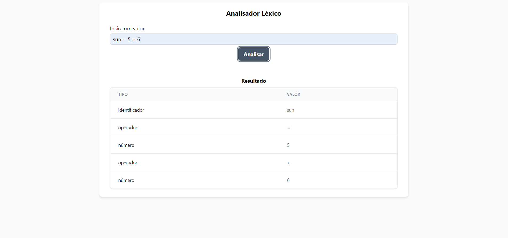

<h4 align="center"> 
	🚀 Code Analysis 🚀
</h4>

  
  
  
  
  
	
  
  

  
   

## 💻 Sobre o projeto

Code Analysis é um projeto que visa ter a implementação de conceitos de Copiladores na prática.

### Visualização

##### Visualize a aplicação web aqui: [Code Analysis](https://code-analysis.netlify.app/)

### Backlog e desenvolvimento do projeto

##### Visualize aqui: [Projeto Code Analysis](https://github.com/users/paulobeckman/projects/1)

### Códigos Principais

- **Análise léxica:** O código responsável por realizar a análise léxica se encontra em: [Análise Léxica](https://github.com/paulobeckman/code-analysis/blob/development/src/utils/lexicalAnalyzer.ts). Esse código é execultado, quando se insere um valor [no input dessa página](https://code-analysis.netlify.app/):
  
